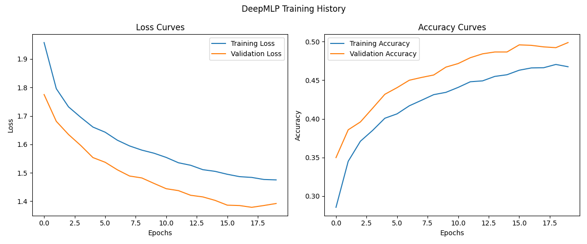
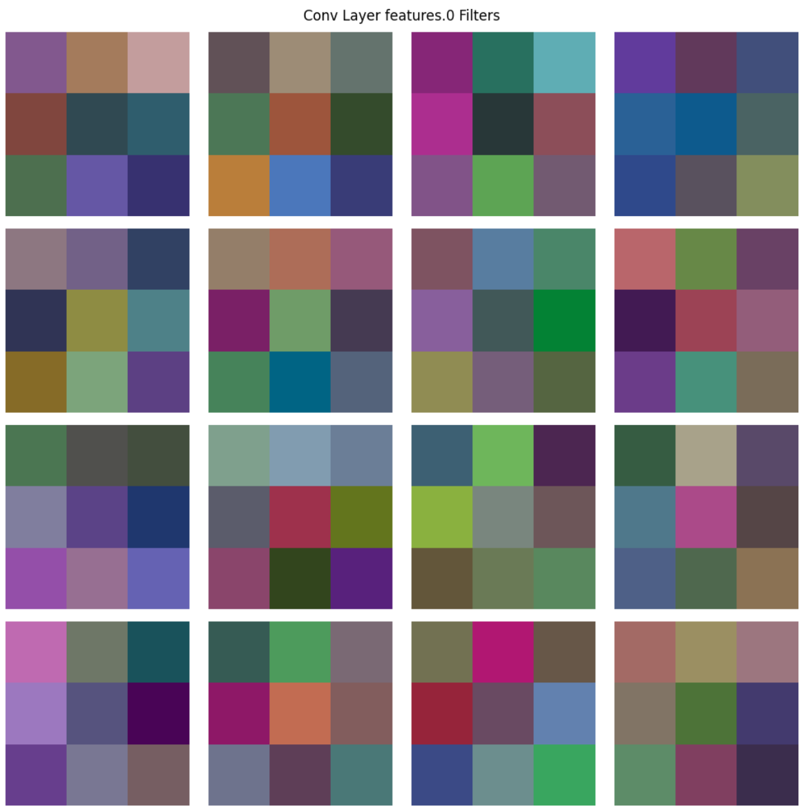
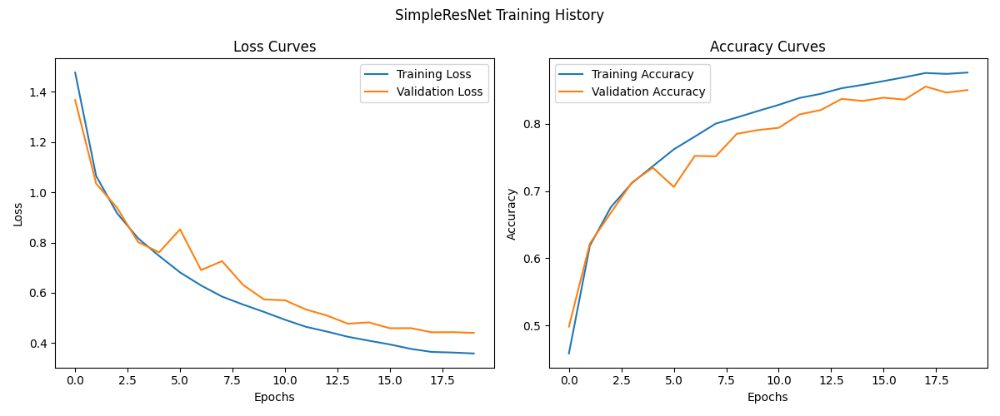
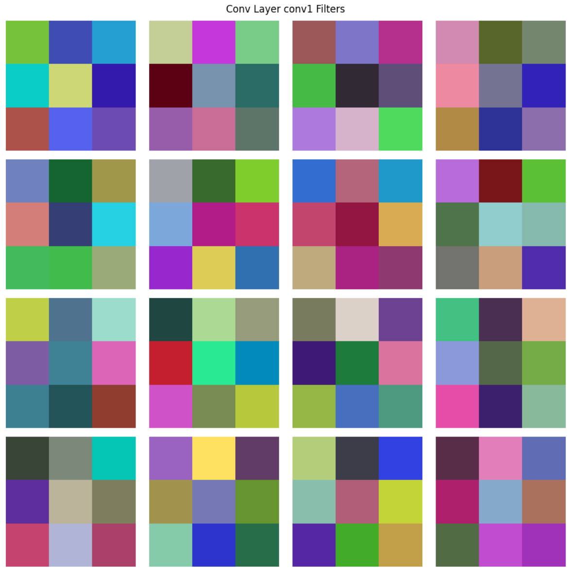

[TOC]


#  实验目的和背景介绍

1. 掌握MLP和CNN的基本原理和实现方法
2. 了解不同网络结构对模型性能的影响
3. 学习深度学习模型训练、评估和可视化的方法
4. 通过对比实验，理解不同模型在图像分类任务中的优缺点
5. 培养深度学习模型调优和问题解决的能力

本实验旨在通过对多层感知机（MLP）和卷积神经网络（CNN）的实现、训练和评估

# 实验原理

## 多层感知机(MLP)

多层感知机是一种前馈神经网络，由输入层、一个或多个隐藏层和输出层组成。 MLP的主要特点 是：

1. 每层神经元与下一层全连接
2. 使用非线性激活函数（如ReLU、Sigmoid等）
3. 通过反向传播算法进行训练

**思考问题**1: MLP在处理图像数据时面临哪些挑战？请从数据结构、参数量和特征提取能力三个角 度分析。

## 卷积神经网络(CNN)

卷积神经网络是为处理具有网格状拓扑结构的数据而设计的神经网络，主要包含卷积层、池化层 和全连接层。CNN的主要特点是：

1. 局部连接：每个神经元只与输入数据的一个局部区域连接
2. 权重共享：同一特征图的所有神经元共享相同的权重
3. 多层次特征提取：低层检测边缘等简单特征，高层组合这些特征形成更复杂的表示

**思考问题**2: CNN相比MLP在处理图像时具有哪些优势？解释卷积操作如何保留图像的空间信息。 

# 实验过程

## MLP

### 了解MLP模型结构

查看 models/mlp.py 文件，理解三种MLP模型的结构：

- SimpleMLP :  单隐层MLP

- DeepMLP:  多隐层MLP，带有BatchNorm和Dropout 
- ResidualMLP:  带有残差连接的MLP

**任务**1:补充TwoLayerMLP代码

### 训练和评估MLP模型

1. 在  train.ipynb   中训练SimpleMLP模型，确保将 model_type 设置为  'simple_mlp '  。
2. 观察训练过程中的损失和准确率变化，以及最终在测试集上的性能。
    **分析问题1**:训练过程中，损失和准确率曲线表现如何？是否出现过拟合或欠拟合？简要分析可能的原因。
3. 修改参数尝试训练DeepMLP模型，将 model_type 设置为  'deep_mlp '  。
    **分析问题2**:对比SimpleMLP和DeepMLP的性能，增加网络深度对性能有何影响？

## CNN

### 了解CNN模型结构

查看 models/cnn.py 文件，理解不同CNN模型的结构：

- SimpleCNN   : 简单的CNN，包含两个卷积层
- MediumCNN   : 中等复杂度的CNN，带有BatchNorm和Dropout
- VGGStyleNet   : VGG风格的CNN，使用连续的3x3卷积  
- SimpleResNet   : 简化的ResNet，包含残差连接

**任务2**:修改 SimpleCNN 代码，添加一个额外的卷积层和BatchNorm

### 训练和评估CNN模型

1. 在  train.ipynb中训练SimpleCNN模型，确保将 model_type 设置为  'simple_cnn '  ，并将 use_data_augmentation  设置为 True  。
2. 观察训练过程和卷积核可视化结果。
    **分析问题3:**卷积核可视化显示了什么模式？这些模式与图像中的哪些特征可能对应？ 
3. 继续训练MediumCNN模型，将 model_type 设置为 'medium_cnn '  。
    **分析问题4:** CNN模型相比MLP在CIFAR-10上的性能有何不同？为什么会有这样的差异？

## VGG和ResNet

###  VGG风格和ResNet风格网络架构
在本部分中，我们将探索两种影响深远的CNN架构：VGG和ResNet。通过理解这些经典架构的设 计理念和特点，可以帮助我们设计更高效的神经网络。
#### VGG架构特点

1. 在  train.ipynb   中训练SimpleMLP模型，确保将 model_type 设置为  'vgg_style '  ，并将
use_data_augmentation  设置为 True  。
2. 观察网络的训练过程和性能。特别注意其收敛速度和最终准确率。

#### ResNet架构及残差连接
1. 在  train.ipynb   中训练SimpleMLP模型，确保将 model_type 设置为  'resnet '  ，并将
use_data_augmentation  设置为 True  。
2. 观察网络的训练过程和性能，特别是深度对训练稳定性的影响。

#### Bottleneck结构

**思考问题3:**分析Bottleneck结构的优势。为什么1×1卷积在深度CNN中如此重要？它如何帮助控 制网络的参数量和计算复杂度？
**探索问题1:** 查看 models/cnn.py   中的 SimpleResNet   实现，分析残差连接是如何实现的。如果输入 和输出通道数不匹配，代码是如何处理的？

### 模型复杂度分析

不同CNN架构在性能和效率之间存在权衡。现在我们将通过分析不同模型的参数量和推理时间来 理解这种权衡。

1. 分析各个模型的复杂度

2. 记录并比较各个模型的参数量和推理时间。
    **分析问题5:** VGG风格和ResNet风格网络的性能比较。残差连接带来了哪些优势？
    **分析问题6**:参数量和推理时间如何影响模型的实用性？如何在性能和效率之间找到平衡？

### 理解高级CNN设计理念

随着深度学习的发展，CNN架构设计也变得更加精细和高效。以下是一些重要的设计理念：

1. **网络深度与宽度平衡**：更深的网络能学习更抽象的特征，但也更难训练；更宽的网络（更多 通道）能捕获更多特征，但参数量增加
2. **跳跃连接**：除了ResNet的残差连接，还有DenseNet的密集连接、 U-Net的跨层连接等
3. **特征增强**：注意力机制（如SENet的通道注意力）、特征融合等

4. **高效卷积设计**：深度可分离卷积（MobileNet）、组卷积（ShuffleNet）等

**探索问题2**:如果你要为移动设备设计一个CNN模型，应该考虑哪些因素来权衡性能和效率？请提 出至少三条具体的设计原则。

### 模型比较与分析
运行 `compare.py `来对比不同模型的性能

**综合分析**: 根据比较结果，分析不同类型模型（MLP和CNN）以及不同复杂度模型的性能差异。考虑以下几点：

1. 测试准确率
2. 参数量
3. 推理时间
4. 训练收敛速度
5. 过拟合/欠拟合情况


# 代码

## **任务**1:补充TwoLayerMLP代码

``` python
class TwoLayerMLP(nn.Module):
    def __init__(self, input_dim=3*32*32):
        super(TwoLayerMLP, self).__init__()
        self.flatten = nn.Flatten()      #展平，把输入的多维数据展平为一维数据
        # 使用nn.Linear, nn.BatchNorm1d, nn.ReLU和nn.Dropout实现两个隐藏层
        self.mlp = nn.Sequential(
            # 第一个隐藏层
            nn.Linear(input_dim, 128),
            nn.BatchNorm1d(128),
            nn.ReLU(),
            nn.Dropout(0.3),
            #第二个隐藏层
            nn.Linear(128, 64),
            nn.BatchNorm1d(64),
            nn.ReLU(),
            nn.Dropout(0.3),
            nn.Linear(64, 10)#输出层
        )

        
    def forward(self, x):
        x = self.flatten(x)      #展平，把输入的多维数据展平为一维数据
        # 实现前向传播
        x = self.mlp(x)
        
        return x


```

## 任务2:修改 SimpleCNN 代码，添加一个额外的卷积层和BatchNorm

``` python
class EnhancedCNN(nn.Module):
    def __init__(self):
        super(EnhancedCNN, self).__init__()
        self.conv1 = nn.Conv2d(3, 16, kernel_size=3, padding=1) # 输入3通道，输出16通道的卷积层
        self.conv2 = nn.Conv2d(16, 32, kernel_size=3, padding=1) # 输入16通道，输出32通道的卷积层
        # 在这里添加一个新的卷积层、BatchNorm和相应的池化层
        self.conv3 = nn.Conv2d(32, 64, kernel_size=3, padding=1)# 输入32通道，输出64通道的卷积层
        self.bn3 = nn.BatchNorm2d(64)# 标准化层

        self.pool = nn.MaxPool2d(2, 2) # 池化层
        self.flatten = nn.Flatten()# 展平层
        # 修改全连接层以适应新的特征图尺寸
        self.fc1 = nn.Linear(64 * 4 * 4, 128)
        self.fc2 = nn.Linear(128, 10)# 输出层

        self.relu = nn.ReLU()
    def forward(self, x):
        # 实现包含新卷积层的前向传播
        x = self.pool(self.relu(self.conv1(x)))# 输出大小: 16x16x16
        x = self.pool(self.relu(self.conv2(x)))# 输出大小: 8x8x32
        x = self.pool(self.relu(self.bn3(self.conv3(x))))# 输出大小: 4x4x64
        x = self.flatten(x)# 展平
        x = self.relu(self.fc1(x)) # 全连接层
        x = self.fc2(x)# 输出层
        return x
```


# 实验结果和分析
## 思考问题
### **思考问题1**

**MLP在处理图像数据时面临哪些挑战？**

答：

1. 数据结构层面：图像数据是二维的，像素间的关系包含空间信息。MLP接受一维向量输入，如果把输入图像展平为一维向量（例如，`3x28x28`的图像变为`2352`维向量），将会导致空间信息丢失。
2. 参数量层面：图像具有的像素点很多，且有多个通道。如果处理`224x224`的RGB图像输入维度为`150528`，假设第一隐藏层有`1024`个神经元，则仅第一层就需要1.5亿参数（`150528x1024`），如此大的计算开销难以接受
3. 特征提取能力层面：图像的特征通常是层次化的（低级特征→边缘→纹理→物体部件→整体物体），而MLP的全局全连接结构难以高效提取这种层次特征。

### **思考问题2**

**CNN相比MLP在处理图像时具有哪些优势？解释卷积操作如何保留图像的空间信息。**

答：
1. CNN的优势：卷积神经网络（CNN）相比多层感知机（MLP）在处理图像数据时具有显著优势，主要体现在其能够有效保留空间信息并大幅减少参数量。CNN通过卷积操作在局部感受野上滑动计算，使每个卷积核仅关注图像的相邻像素（如3×3或5×5区域），从而捕捉边缘、纹理等局部特征，同时保持输出特征图的空间结构。这种局部感知机制和权重共享（同一卷积核在整个图像上复用）不仅增强了模型对平移、旋转等几何变换的鲁棒性，还极大降低了参数量——例如，一个3×3卷积核仅需9个参数，而MLP在处理高分辨率图像时需要数百万甚至数十亿的全连接参数。此外，CNN的层次化结构（如堆叠的卷积层和池化层）能自动学习从低级到高级的视觉特征（如边缘→纹理→物体部件→完整物体），而MLP由于缺乏空间归纳偏置，难以高效提取此类层次化特征。因此，CNN在图像分类、目标检测等任务中表现更优。
2. 卷积操作：卷积操作通过局部连接、权重共享和平移不变性有效保留了图像的空间信息。卷积核（如3×3或5×5）以滑动窗口的方式在图像上局部计算，每个输出像素仅对应输入图像的特定小区域（感受野），从而维持了像素间的空间关系。这种局部感知机制使卷积能够直接捕捉边缘、纹理等空间特征，而不像MLP那样破坏图像结构。同时，权重共享让同一个卷积核在整个图像上重复使用，不仅大幅减少参数量，还保证了模型对图像不同位置出现的相同模式（如猫耳朵）具有一致的响应，即平移不变性。最终输出的特征图仍保持二维结构，使得后续网络层能继续处理空间信息，这是CNN在图像任务上优于MLP的关键原因。

### **思考问题3**

**分析Bottleneck结构的优势。为什么1×1卷积在深度CNN中如此重要？它如何帮助控制网络的参数量和计算复杂度？**

答：Bottleneck通过1×1卷积实现“先压缩后扩展”，在保持网络性能的前提下显著减少计算资源消耗。在残差网络中，Bottleneck结构允许梯度直接通过1×1卷积的快捷路径传播，缓解了深度网络的梯度消失问题，同时避免了直接对高维特征进行3×3卷积的高成本操作。这种设计通过减少中间特征图的通道数（如从256维压缩到64维），大幅降低后续3×3卷积的计算量，再通过1×1卷积恢复原始通道数。


## 模型训练
> [!warning]
>
> - 所有以下实验均在本地运行，所有device使用cuda，使用一块4080 laptop。因为是自己的电脑，所以运行环境不一定完全稳定，性能上可能有一定偏差。
> - 未避免实验报告过于繁杂，未包含混淆矩阵，分类表格等结果的可视化，仅保留了训练曲线。

### MLP

**SimpleMLP**

- 训练曲线：


- 最终测试准确率：0.5114
- 参数量: 1,578,506 
- 每批次(128个样本)推理时间: 0.07ms 
- 训练总时间：224s

**DeepMLP**

- 训练曲线：



- 最终测试准确率：0.5284
- 参数量: 3,809,034 
- 每批次(128个样本)推理时间: 0.25ms 
- 训练总时间：801s

#### **分析问题1**

**训练SimpleMLP过程中，损失和准确率曲线表现如何？是否出现过拟合或欠拟合？简要分析可能的原因。**

答：是正常的训练表现，并且训练集和验证集表现相似，没有过拟合问题。但是训练和验证集的准确率均不高，最终测试准确率也只有0.5114，有欠拟合的问题。这主要是因为MLP处理图像数据无法捕捉空间特征，加上simpleMLP本身参数较少，结构简单，无法很好地拟合数据集。

#### **分析问题2**

**对比SimpleMLP和DeepMLP的性能，增加网络深度对性能有何影响？**

答：观察DeepMLP训练曲线。增加深度后模型的训练表现并没有增加，反而有一定下降。最终测试准确率为0.5284，几乎没有提升。

模型性能对比：

- SimpleMLP：参数量: 1,578,506 每批次(128个样本)推理时间: 0.07ms 训练总时间：224s
- DeepMLP: 参数量: 3,809,034 每批次(128个样本)推理时间: 0.25ms 训练总时间：801s

两者推理时间均不长，但是deepmlp明显数倍于simplemlp。故增加网络深度会增加推理速度，同理，训练时间也会增加。

### CNN

**SimpleCNN**：

- 训练曲线：
  

- 测试准确率: 0.7204
- 卷积核可视化：
  
- 参数量: 268,650 
- 每批次(128个样本)推理时间: 0.47ms
- 总训练时间: 239s

**MediumCNN：**

- 训练曲线：
  
- 测试准确率: 0.8356
- 卷积可视化：
  
- 参数量: 2,169,770 
- 每批次(128个样本)推理时间: 0.88ms
- 总训练时间: 723.70s

#### **分析问题3**

**卷积核可视化显示了什么模式？这些模式与图像中的哪些特征可能对应？**

答：卷积核可视化显示了每个卷积核中的权重都有区别，这表明卷积核提取了感受野中的不同特征。某些卷积核可能专注于检测特定方向的边缘（如水平、垂直或对角线）。一些卷积核可能对特定颜色或颜色组合敏感，帮助模型识别图像中的颜色模式。卷积核也可能学习到简单的纹理特征，如条纹或网格状结构。

#### **分析问题4**

**CNN模型相比MLP在CIFAR-10上的性能有何不同？为什么会有这样的差异**

答：在CIFAR-10数据集上，CNN表现明显优于MLP，因为CNN能够有效利用图像的空间结构。卷积层通过局部连接和共享权重捕捉图像中的模式，使得模型在参数数量较少的情况下高效学习特征。此外，CNN通过多层卷积和池化层逐步提取从低级到高级的特征，能够关注局部区域并捕捉局部细节。相比之下，MLP通常将输入数据扁平化处理，忽略了图像的二维结构，且需要更多参数，这容易导致过拟合。因此，CNN在图像分类任务中具有显著优势。

### VGG和ResNet

**VGG**：

- 训练曲线：
  
- 测试准确率: 0.7204
- 卷积核可视化：
  
- 参数量: 3,251,018 
- 每批次(128个样本)推理时间: 3.02ms
- 总训练时间: 324s

**ResNet**：

- 训练曲线：
  
- 测试准确率: 0.7204
- 卷积核可视化：
  
- 参数量: 175,258 
- 每批次(128个样本)推理时间: 4.39ms
- 总训练时间: 294s

#### **探索问题1**

**查看 models/cnn.py 中的 SimpleResNet 实现，分析残差连接是如何实现的。如果输入 和输出通道数不匹配，代码是如何处理的？**

答：在 `SimpleResNet` 的实现中，残差连接是通过 `ResidualBlock` 类实现的。当输入和输出通道数不匹配（`in_channels != out_channels`）或者需要进行下采样（`stride != 1`）时，代码通过 `shortcut` 分支中的 1x1 卷积配合批量归一化来处理维度匹配问题。具体来说，`ResidualBlock` 的 `shortcut` 是一个顺序模块，当且仅当 `stride != 1` 或 `in_channels != out_channels` 时，该模块会包含一个 1x1 卷积（用于调整通道数和空间尺寸）和一个批量归一化层。在正向传播过程中，主路径的两个 3x3 卷积的输出会与经过 `shortcut` 处理后的输入相加，从而实现残差连接。这种设计确保了无论输入和输出的维度是否匹配，残差连接都能正确工作。

### 复杂度对比

输出如下：

```
分析SimpleMLP 复杂度 :
参数量: 1,578,506
每批次(128个样本)推理时间: 0.06ms

分析DeepMLP 复杂度 :
参数量: 3,809,034
每批次(128个样本)推理时间: 0.24ms

分析SimpleCNN 复杂度 :
参数量: 268,650
每批次(128个样本)推理时间: 0.22ms

分析MediumCNN 复杂度 :
参数量: 2,169,770
每批次(128个样本)推理时间: 0.74ms

分析VGGStyleNet 复杂度 :
参数量: 3,251,018
每批次(128个样本)推理时间: 7.57ms

分析SimpleResNet 复杂度 :
参数量: 175,258
每批次(128个样本)推理时间: 1.47ms
```

#### **分析问题5**
**VGG风格和ResNet风格网络的性能比较。残差连接带来了哪些优势？**
答：

1. **缓解梯度消失问题**: 残差连接使得梯度可以直接从后层传递到前层，促进深层网络的训练。
2. **提高训练速度**: 通过更快的梯度传播，网络可以更快地收敛。
3. **更好的泛化能力**: 残差结构允许网络学习到更复杂的特征，提高模型的泛化能力。
4. **更少的参数量**: 在相似性能下，ResNet通常需要更少的参数量，降低了存储和计算成本。

#### **分析问题6**

**参数量和推理时间如何影响模型的实用性？如何在性能和效率之间找到平衡？**
答：

1. 参数量的影响

   1. **存储需求**: 较大的参数量需要更多的存储空间，这可能在资源有限的设备上成为瓶颈。

   1. **训练时间**: 更多的参数通常意味着更长的训练时间，因为需要更新更多的权重。

   1. **过拟合风险**: 较大的模型可能更容易过拟合，尤其在训练数据不足时。

2. 推理时间的影响

   1. **实时性**: 较长的推理时间可能不适用于实时应用，例如自动驾驶或实时视频分析。

   1. **计算资源**: 长时间的推理需要更强的计算能力，可能导致更高的能耗和成本。

   1. **用户体验**: 在用户交互的应用中，较长的响应时间可能降低用户体验。

3. 在性能和效率之间找到平衡

   1. **任务需求**: 根据具体任务选择合适的模型。如果任务要求高精度，可以选择复杂模型；如果要求实时性，选择较轻量的模型。

   1. **模型压缩**: 使用模型压缩技术，如剪枝、量化和蒸馏，减少参数量和推理时间，同时保持性能。

   1. **架构优化**: 使用更高效的网络架构，如MobileNet或EfficientNet，专门设计用于在有限资源下实现良好性能。

   1. **硬件利用**: 利用专用硬件加速器（如GPU、TPU），提高推理速度。

   1. **混合精度训练**: 采用混合精度训练技术，减少计算负荷，提高训练和推理效率。

### 理解高级CNN设计理念

#### **探索问题2**
**如果你要为移动设备设计一个CNN模型，应该考虑哪些因素来权衡性能和效率？请提出至少三条具体的设计原则。**

答：

1. **计算效率优先**：移动端硬件性能不佳且需要时效性，故采用轻量级卷积结构。具体设计：

   - **深度可分离卷积替代标准卷积**
     将标准卷积拆分为深度卷积（逐通道卷积） + 点卷积（1x1卷积）（如MobileNet）

   - **通道剪枝与动态稀疏化**
     通过通道注意力（如SENet）动态抑制冗余通道，或训练时引入稀疏约束（如L1正则化），直接减少推理时的通道数量，降低内存和计算开销。

   - **避免大尺寸特征图**
     通过**早期下采样**（如Stem模块）快速降低输入分辨率，减少后续层的计算量（例如将224x224输入在首层降为112x112）。
2. **轻量化网络架构设计**：

   - **残差连接 + 特征复用**
     通过残差块（ResNet）或密集连接（DenseNet）复用底层特征，减少重复计算。例如，DenseNet的密集连接可使参数量减少40%的同时提升精度。

   - **全局平均池化替代全连接层**
     移除传统CNN末端的全连接层（如VGG的4096维FC层），改用全局平均池化（GAP）直接输出分类结果，参数量减少90%以上。
3. **硬件感知优化与部署适配**
   - **量化与低精度推理**
     使用**8位整数量化（INT8）** 替代32位浮点计算，模型大小减少4倍，内存带宽降低75%（如TensorFlow Lite量化模型）。支持硬件加速（如ARM NPU的INT8指令集）。
   - **算子硬件适配优化**
     针对移动端GPU/DSP设计**NHWC内存布局**（而非传统NCHW），利用硬件加速的矩阵乘（如Adreno GPU的OpenCL优化）。避免使用移动端低效操作（如大尺寸转置卷积）。
   - **动态网络结构适配**
     根据设备算力动态调整模型复杂度：
     - **分辨率自适应**：低端设备使用小输入（如128x128），高端设备使用大输入（224x224）。
     - **条件计算**：通过门控机制跳过部分分支（如Switchable Networks），仅在必要时激活复杂模块。


### 模型比较与分析


# 创新探索任务

## 迁移学习

### 代码

使用timm的预训练vision transformer，改变输入图像尺寸和输出以适配cifar-10任务。

模型定义`vit.py`：

``` python
import torch
import torch.nn as nn
import torch.nn.functional as F
from transformers import ViTModel
from torchvision import transforms
import timm

class PretrainedViT(nn.Module):
    """使用预训练的Vision Transformer模型，适配CIFAR-10"""
    def __init__(self, model_name='vit_tiny_patch16_224', num_classes=10, img_size=32):
        super(PretrainedViT, self).__init__()
        
        # 加载预训练模型
        self.model = timm.create_model(model_name, pretrained=True)
        
        # 替换分类头以匹配CIFAR-10的类别数
        self.embedding_dim = self.model.head.in_features
        self.model.head = nn.Linear(self.embedding_dim, num_classes)
        
        # 由于预训练模型通常设计用于224x224图像，我们需要调整CIFAR-10的32x32图像
        self.img_size = img_size
        
        # 定义图像预处理转换
        self.transform = transforms.Compose([
            transforms.Resize(224),  # 调整为模型预期的尺寸
            transforms.Normalize(
                mean=[0.5, 0.5, 0.5],
                std=[0.5, 0.5, 0.5]
            )
        ])
        
        # 初始化新的分类头
        nn.init.zeros_(self.model.head.bias)
        
    def forward(self, x):
        # 调整图像大小以匹配预训练模型的预期输入
        x = self.transform(x)
        
        # 前向传播通过预训练模型
        x = self.model(x)
        
        return x
```

将其注册到model中，`models/__init__.py`:

``` python
from .mlp import SimpleMLP, DeepMLP, ResidualMLP
from .cnn import SimpleCNN, MediumCNN, VGGStyleNet, SimpleResNet
from .vit import PretrainedViT
```

训练以及评估同其他模型：

``` python
import torch
import torch.nn as nn
import torch.optim as optim
import os

# 导入项目中的模块
from models import SimpleMLP, DeepMLP, ResidualMLP, SimpleCNN, MediumCNN, VGGStyleNet, SimpleResNet, PretrainedViT
from utils import (
    load_cifar10,
    set_seed,
    train_model,
    evaluate_model,
    plot_training_history,
    visualize_model_predictions,
    visualize_conv_filters,
    model_complexity
)
# 设置参数
model_type = 'simple_mlp'  # 可选: 'simple_mlp', 'deep_mlp', 'residual_mlp', 'simple_cnn', 'medium_cnn', 'vgg_style', 'resnet'
epochs = 20
learning_rate = 0.001
batch_size = 128
use_data_augmentation = True  # CNN通常受益于数据增强
save_directory = './ck'
visualize_filters = True  # 是否可视化卷积核（仅对CNN有效）
visualize_predictions = True  # 是否可视化预测结果

# 设置随机种子
set_seed()

#因为mo平台的提交任务机制，需要手动切换到该文件夹下。
# os.chdir(os.path.expanduser("~/work/Jianhai/lab5"))

# 检查是否有可用的GPU
device = torch.device('cuda:0' if torch.cuda.is_available() else 'cpu')
print(f"使用设备: {device}")

# 加载数据
train_loader, valid_loader, test_loader, classes = load_cifar10(
    use_augmentation=use_data_augmentation,
    batch_size=batch_size
)

# 初始化选择的模型

model_type = 'PretrainedViT'
model = PretrainedViT()
model_name = "PretrainedViT"

# 计算模型复杂度
print("\n分析模型复杂度:")
model_complexity(model, device=device)

# 定义损失函数和优化器
criterion = nn.CrossEntropyLoss()
optimizer = optim.Adam(model.parameters(), lr=learning_rate)

# 可以添加学习率调度器
scheduler = optim.lr_scheduler.CosineAnnealingLR(optimizer, T_max=epochs)

# 确保checkpoints目录存在
os.makedirs(save_directory, exist_ok=True)

# 训练模型
trained_model, history = train_model(
    model, train_loader, valid_loader, criterion, optimizer, scheduler,
    num_epochs=epochs, device=device, save_dir=save_directory
)

# 绘制训练历史
plot_training_history(history, title=f"{model_name} Training History")

# 在测试集上评估模型
print("\n在测试集上评估模型:")
test_loss, test_acc = evaluate_model(trained_model, test_loader, criterion, device, classes)

print(f"{model_name} 最终测试准确率: {test_acc:.4f}")

# 如果是CNN模型并且需要可视化卷积核
if visualize_filters and model_type in ['simple_cnn', 'medium_cnn', 'vgg_style', 'resnet']:
    print("\n可视化卷积核:")
    if model_type == 'simple_cnn':
        visualize_conv_filters(trained_model, 'conv1')
    elif model_type == 'medium_cnn':
        visualize_conv_filters(trained_model, 'conv1')
    elif model_type == 'vgg_style':
        visualize_conv_filters(trained_model, 'features.0')
    else:  # resnet
        visualize_conv_filters(trained_model, 'conv1')

# 如果需要可视化模型预测
if visualize_predictions:
    print("\n可视化模型预测:")
    visualize_model_predictions(trained_model, test_loader, classes, device)

print(f"\n{model_name}的训练和评估已完成！")

```
### 结果

- 训练曲线：
  

- 测试准确率: 0.8713

- 参数量: 5,526,346
- 每批次(128个样本)推理时间: 46.72ms
- 总训练时间: 1355s

## 自监督学习

### 代码

自监督学习指通过数据本身自动生成标签（或称“伪标签”）来训练模型，而无需依赖人工标注的数据。这一过程目的是提取输入的特征。

本实验中采用的数据还是cifar-10，输出从已知的标签改成了自己生成的旋转角度。每个图片随机旋转0 ,90, 180, 270°，生成对应的标签。我们的自监督任务是预测旋转角度。

采用simpleCNN作为backbone，把最后的fc2层的输出维度改成了4。在训练过后，理论上backbone输出的128维向量包含了图片信息，在此基础上微调应该能获得比单纯的simpleCNN训练更好的效果。这里没实现后续的微调，只实现了自监督学习的部分。

模型定义`RotationNet.py`: 

``` python
import torch
import torch.nn as nn
import torch.nn.functional as F
from torchvision import transforms
import numpy as np
from .cnn import SimpleCNN
# 没有分类头的CNN模型，作为backbone使用
# 除了分类头外和cnn中的SimpleCNN完全相同
class SimpleCNN_no_head(nn.Module):
    def __init__(self):
        super(SimpleCNN_no_head, self).__init__()
        self.conv1 = nn.Conv2d(3, 16, kernel_size=3, padding=1)
        self.conv2 = nn.Conv2d(16, 32, kernel_size=3, padding=1)
        self.pool = nn.MaxPool2d(2, 2)
        self.fc1 = nn.Linear(32 * 8 * 8, 128)
        self.relu = nn.ReLU()

    def forward(self, x):
        x = self.pool(self.relu(self.conv1(x)))  # 输出大小: 16x16x16
        x = self.pool(self.relu(self.conv2(x)))  # 输出大小: 8x8x32
        x = x.view(-1, 32 * 8 * 8)  # 展平
        x = self.relu(self.fc1(x))
        return x

class RotationNet(nn.Module):
    """基于旋转预测的自监督学习模型"""
    def __init__(self, backbone=None):
        super(RotationNet, self).__init__()
        self.backbone = SimpleCNN_no_head() 
        self.clissifier = nn.Linear(128, 4) # 分类头，4个类别对应4种旋转

    
    def forward(self, x):
        # 前向传播
        x = self.backbone(x) # 提取特征 
        x = self.clissifier(x) # 分类头
        return x


def generate_rotations(image):
    # 生成旋转图像和对应的标签
    """为每张图像生成4种旋转 (0°, 90°, 180°, 270°)"""
    rotations = []
    labels = []
    
    # 原始图像 - 0°
    rotations.append(image)
    labels.append(0)
    
    # 旋转90°
    rot90 = transforms.functional.rotate(image, 90)
    rotations.append(rot90)
    labels.append(1)
    
    # 旋转180°
    rot180 = transforms.functional.rotate(image, 180)
    rotations.append(rot180)
    labels.append(2)
    
    # 旋转270°
    rot270 = transforms.functional.rotate(image, 270)
    rotations.append(rot270)
    labels.append(3)
    
    return rotations, labels
```

训练和评估`TrainRotationNet.py`：

``` python
import torch
import torch.nn as nn
import torch.optim as optim
from torch.utils.data import Dataset, DataLoader
import torchvision
import torchvision.transforms as transforms
import matplotlib.pyplot as plt
import numpy as np
import warnings 
import os

from models import RotationNet, generate_rotations
from utils.data_loader import load_cifar10
from utils.train_utils import train_model, evaluate_model
from utils.train_utils import plot_training_history

# 创建自监督数据集
class RotationDataset(Dataset):
    def __init__(self, original_dataset):
        self.original_dataset = original_dataset
        
    def __len__(self):
        return len(self.original_dataset)
        
    def __getitem__(self, idx):
        image, _ = self.original_dataset[idx]  # 忽略原始标签
        rotated_images, rotation_labels = generate_rotations(image)
        
        # 随机选择一个旋转版本
        choice = np.random.randint(0, 4)
        return rotated_images[choice], rotation_labels[choice]

# 主函数
def main():
    # 设置参数
    batch_size = 128
    epochs = 20
    learning_rate = 0.001
    device = torch.device('cuda:0' if torch.cuda.is_available() else 'cpu')
    save_directory = './checkpoints/self_supervised'
    os.makedirs(save_directory, exist_ok=True)
    
    print(f"使用设备: {device}")
    
    # 加载数据
    train_loader, valid_loader, test_loader, classes = load_cifar10(
        use_augmentation=False,  # 不使用数据增强，因为我们要做旋转
        batch_size=batch_size
    )
    
    # 创建自监督数据集和加载器
    ss_train_dataset = RotationDataset(train_loader.dataset)
    ss_valid_dataset = RotationDataset(valid_loader.dataset)
    
    ss_train_loader = DataLoader(
        ss_train_dataset, batch_size=batch_size, shuffle=True, num_workers=2)
    ss_valid_loader = DataLoader(
        ss_valid_dataset, batch_size=batch_size, shuffle=False, num_workers=2)
    
    # 创建自监督模型
    model = RotationNet().to(device)
    
    # 定义损失函数和优化器
    criterion = nn.CrossEntropyLoss()
    optimizer = optim.Adam(model.parameters(), lr=learning_rate)
    scheduler = optim.lr_scheduler.CosineAnnealingLR(optimizer, T_max=epochs)
    
    # 训练模型
    print("开始自监督预训练...")
    trained_model, history = train_model(
        model, ss_train_loader, ss_valid_loader, criterion, optimizer, scheduler,
        num_epochs=epochs, device=device, save_dir=save_directory
    )
    
    
    # 可视化训练历史
    plot_training_history(history, title="Self-Supervised Training History")


if __name__ == "__main__":
    warnings.filterwarnings("ignore")
    warnings.filterwarnings("ignore", category=FutureWarning)
    main()
```

### 结果

训练曲线：


在自己生成标签的情况下能有较高的准确性，证明backbone正确地提取了特征。之后进行微调就可以了。

# 结论和思考


# 参考文献